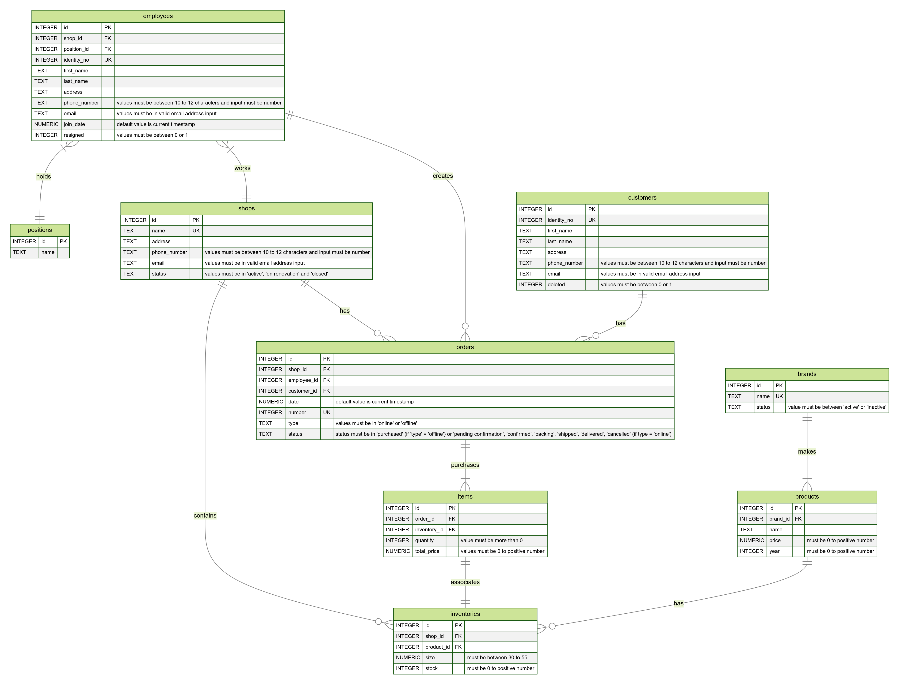

# Design Document

By Hansel Tertius

Video overview: https://youtu.be/x-JarJ6Igmc

## Scope

In this section you should answer the following questions:

What is the purpose of your database?  
The purpose of the database is to store data of shoe warehouse's customers, employees, shops, inventories provided by each shop including products and brands, as well as the order history and the items inside it. 

Things that are included inside of the database are:  
1. Customers : represents customers that are included in the shoe warehouse order history.
2. Shops : represents list of branches provided in a shoe warehouse.
3. Positions : represents list of job title available for an employee that is working in a shop.
4. Employees : represents list of employees working in a shop.
5. Brands : represents manufacturer of a shoe.
6. Products : represents a shoe model that is associated with a brand.
7. Inventories : represents list of stocks in a product.
8. Orders : represents status of a purchase made by customer.
9. Items : represents a list of items purchased in a order.

The things that are not included in a database scope are:  
1. membership system for a customers to receive special promotions and benefits.
2. list of suppliers
3. list of active promotions for products, shops or even customers.

## Functional Requirements

In this section you should answer the following questions:

* What should a user be able to do with your database?  
In the database, a user should be able to :  
1. Add, update and delete customers, shops, employees, positions, brands, products, inventories, orders and items
2. Search for specific customers by first name and last name
3. Search for specific active employees by first name, last name, shop where the employees are working as well as the join date
4. Manage active employees data that are working in a shoe warehouse by changing shop where the employees are working, promote / demote specific employee, update resign status
5. Search products by brands and price
6. Manage available products in a shop
7. Search active inventories by brands, products, size as well as shop name
8. Manage active inventories, such as adding a new product to the shop or restock an existing product
9. Generate invoices based on orders and items generated inside the order

* What's beyond the scope of what a user should be able to do with your database?  
In the database, a user should not be able to :  
1. Inserting duplicate customer data, where database can check the identity no of newly created customer
2. Inserting duplicate employee data, where database can check the identity no of newly created employee
3. Trying to insert item into inventory in an inactive shop
4. Trying to insert order where the employee is not in selected shop
5. Trying to insert item into the order when the item retrieved from inventory is out of stock
6. Trying to insert item into the order when the item retrieved from inventory is not in selected shop

## Representation

### Entities

<u>Customers:</u>
1. "id" : specifies the id of a customer, where the type is INTEGER and the constraint is PRIMARY KEY since the value must be unique and AUTOINCREMENT to make the id to continue on increasing even when the customer has been deleted from the table.
2. "identity_no" : specifies the identity number of a customer, where the type is INTEGER as we only accept number and we have UNIQUE and NOT NULL constraint where we cannot accept duplicate identity no
3. "first_name" : specifies the first name of a customer, where the type is TEXT and we need to fill the name as we have NOT NULL constraint 
4. "last_name" : specifies the last name of a customer, where the type is TEXT and we don't have NOT NULL constraint as some names only have the first name
5. "address" : specifies the address of a customer where we accept strings in a form of TEXT and we need to input the value as the field has NOT NULL constraint 
6. "phone_number" : specifies the phone number of a customer, where we can accept value like + sign that makes the field to have TEXT type
7. "email" : specifies the email of a customer, where we have TEXT type and check for valid email through CHECK constraint using '%_@_%._%'
8. "deleted" : specifies the deleted customer status, where boolean in SQLite can only accept integer of 0 - 1, which makes the type of INTEGER. Also, we have CHECK constraint if the value is either 0 or 1 and DEFAULT value of 0.

<u>Shops:</u>
1. "id" : specifies the id of a shop, where the type is INTEGER and the constraint is PRIMARY KEY since the value must be unique and AUTOINCREMENT to make the id to continue on increasing even when the shop has been deleted from the table
2. "name" : specifies the name of a shop, where the type is TEXT and we need to fill out the value by NOT NULL constraint
3. "address" : specifies the address of a shop, where we accept TEXT data type and has NOT NULL constraint as it is required field
4. "phone_number" : specifies the phone number of a shop, where we accept the TEXT data type since we can accept values like + sign
5. "email" : specifies the email of a shops, where we have TEXT type and check for valid email through CHECK constraint using '%_@_%._%'
6. "status" : specifies the status of a shop where the value accepts TEXT data type and we only accept 'active', 'on renovation', 'closed' value through CHECK constraint

<u>Positions:</u>
1. "id" : specifies the id of a position, where the type is INTEGER and the constraint is PRIMARY KEY since the value must be unique and AUTOINCREMENT to make the id to continue on increasing even when the shop has been deleted from the table
2. "name" : specifies the name of a position, where we accept string as a value through TEXT and it is a required field through NOT NULL constraint

<u>Employees:</u>
1. "id" : specifies the id of an employee, where the type is INTEGER and the constraint is PRIMARY KEY since the value must be unique and AUTOINCREMENT to make the id to continue on increasing even when the employee has been deleted from the table
2. "shop_id" : specifies the id of a shop that an employee works with, where the type is INTEGER. The constraint is FOREIGN KEY where we referenced from id attribute in shops table, and we have NOT NULL constraint as we need a reference value
3. "position_id" : specifies the id of a current position that an employee holds, where the type is INTEGER. The constraint of the column is FOREIGN KEY where we referenced from id attribute in positions table, and we have NOT NULL constraint as we need a reference value
4. "identity_no" : specifies the identity no of an employee, where the type is INTEGER as we only accept number and we have UNIQUE and NOT NULL constraint where we cannot accept duplicate identity no
5. "first_name" : specifies the first name of an employee, where the type is TEXT as we accept string values in a name and we have NOT NULL constraint as the field is required
6. "last_name" : specifies the last name of an employee, where the type is TEXT as we accept string values, we don't have NOT NULL constraint as some names only have the first name
7. "address" : specifies the address of an employee, where we accept TEXT data type and has NOT NULL constraint as it is required field
8. "phone_number" : specifies the phone number of an employee, where we accept the TEXT data type since we can accept values like + sign
9. "email" : specifies the email address of an employee, where we have TEXT type and check for valid email through CHECK constraint using '%_@_%._%'
10. "join_date" : specifies the join date of an employee, where we have NUMERIC data type as SQLite cannot accept DATETIME data type, the field is mandatory so that we have NOT NULL constraint and default value of CURRENT_TIMESTAMP with specifies the time where the data is created.
11. "resigned" : specifies whether the employee has resigned. The accepted data type is INTEGER as SQLite does not support boolean data type, where we only input 0 and 1 through CHECK constraint. By using DEFAULT constraint, it specifies that the default value is 0.

<u>Brands:</u>
1. "id" : specifies the id of a brand, where the type is INTEGER and the constraint is PRIMARY KEY since the value must be unique and AUTOINCREMENT to make the id to continue on increasing even when the brand has been deleted from the table
2. "name" : specifies the name of a brand, where the type is TEXT and the field is required and there is no duplicate values as brand is related to the trademark, which makes UNIQUE and NOT NULL constraint to be installed
3. "status" : specifies the status of a brand, where the typs is TEXT as well as the value is required (NOT NULL constraint). However, we limit the value into 'active' and 'inactive' through CHECK constraint

<u>Products:</u>
1. "id" : specifies the id of a product, where the type is INTEGER and the constraint is PRIMARY KEY since the value must be unique and AUTOINCREMENT to make the id to continue on increasing even when the brand has been deleted from the table
2. "brand_id" : specifies the id of a brand that a product holds, where the type is INTEGER. The constraint of the column is FOREIGN KEY where we referenced from id attribute in brands table, and we have NOT NULL constraint as we need a reference value
3. "name" : specifies the name of a product, where we accept the string value in a form of TEXT. The field is mandatory as we have NOT NULL constraint in the column
4. "price" : specifies the price of a product, where we have the NUMERIC data type as the value can hold decimal place. In terms of price, we cannot accept 0 / negative value as we have CHECK if the price is more than 0
5. "year" : specifies the year where the product is produced, where we accept the INTEGER data type and we cannot have 0 / negative value by having a CHECK constraint where the price is more than 0

<u>Inventories:</u>
1. "id" : specifies the id of a inventory, where the type is INTEGER and the constraint is PRIMARY KEY since the value must be unique and AUTOINCREMENT to make the id to continue on increasing even when the brand has been deleted from the table
2. "shop_id" : specifies the id of a shop that an inventory has, where the type is INTEGER. The constraint of the column is FOREIGN KEY where we referenced from id attribute in shops table, and we have NOT NULL constraint as we need a reference value
3. "product_id" : specifies the id of a product that an inventory has, where the type is INTEGER. The constraint of the column is FOREIGN KEY where we referenced from id attribute in products table, and we have NOT NULL constraint as we need a reference value
4. "size" : specifies the size of a shoe, where the data type is NUMERIC since shoe size has decimal values and the range is BETWEEN 30 to 55
5. "stock" : specifies the stock of a shoe, where the data type is INTEGER, we cannot have negative value in stock as we have CHECK constraint to see if the stock is more than or equal to 0. The default value of a stock is 0.

<u>Orders:</u>
1. "id" : specifies the id of an order, where the type is INTEGER and the constraint is PRIMARY KEY since the value must be unique and AUTOINCREMENT to make the id to continue on increasing even when the order has been deleted from the table
2. "shop_id" : specifies the id of a shop that an order has, where the type is INTEGER. The constraint of the column is FOREIGN KEY where we referenced from id attribute in shops table, and we have NOT NULL constraint as we need a reference value
3. "employee_id" : specifies the id of a employee that an order has, where the type is INTEGER. The constraint of the column is FOREIGN KEY where we referenced from id attribute in employees table, and we have NOT NULL constraint as we need a reference value
4. "customer_id" : specifies the id of a customer that an order has, where the type is INTEGER. The constraint of the column is FOREIGN KEY where we referenced from id attribute in customers table, and we have NOT NULL constraint as we need a reference value
5. "date" : represents date where the order is created. We have NUMERIC data type as SQLite cannot accept DATETIME data type, the field is mandatory so that we have NOT NULL constraint and default value of CURRENT_TIMESTAMP with specifies the time where the data is created.
6. "number" : represents order number where the type is INTEGER. The value of order number must be unique to identify the order and it must be filled, which makes UNIQUE and NOT NULL constraint applied.
7. "type" : specifies the type of the order where the data type is TEXT, we need to have the value of either 'online' or 'offline' using CHECK constraint and the value must be filled, which makes NOT NULL constraint reasonable.
8. "status" : specifies the status of the order where the data type is TEXT and we need to have the value of :
a. if the type is 'online', then we have CHECK constraints where the accepted values are : 'pending confirmation', 'confirmed', 'packing', 'shipped', 'delivered', 'cancelled' 
b. if the type is 'offline', then we have CHECK constraints where the accepted value is only 'purchased' 

<u>Items:</u>
1. "id" : specifies the id of an item, where the type is INTEGER and the constraint is PRIMARY KEY since the value must be unique and AUTOINCREMENT to make the id to continue on increasing even when the item has been deleted from the table
2. "order_id" : specifies the id of a order that an item has, where the type is INTEGER. The constraint of the column is FOREIGN KEY where we referenced from id attribute in orders table, and we have NOT NULL constraint as we need a reference value
3. "inventory_id" : specifies the id of a inventory that an item has, where the type is INTEGER. The constraint of the column is FOREIGN KEY where we referenced from id attribute in inventories table, and we have NOT NULL constraint as we need a reference value
4. "quantity" : specifies the quantity of an item, where the type is INTEGER as we don't accept decimal values and we have NOT NULL constraint
5. "total_price" : specifies the total price of an item where the type is NUMERIC as we accept decimal values and we have the default value of 0 using DEFAULT constraint and we don't accept negative values by using CHECK constraint if the value is more than or equal to 0.

### Relationships

The entity relationship diagram shows the relationships between entities in my database.

<u>Descriptions:</u>
1. employees => positions :
a. 1 employee holds 1 position, while 1 position is held by at least 1 employee
b. this type of relationship specifies one-to-many relationship 
2. employees => shops :
a. 1 employee works in 1 shop, while 1 shop is worked by at least 1 employee
b. this type of relationship specifies one-to-many relationship
3. shops => orders : 
a. 1 shop has 0 to many orders, while 1 order is linked to 1 shop
b. this type of relationship specifies one-to-many relationship
4. shops => inventories : 
a. 1 shop has 0 to many inventories, while 1 inventory is linked to 1 shop
b. this type of relationship specifies one-to-many relationship
5. employees => orders : 
a. 1 employee creates 0 to many orders, while 1 order is created by 1 employee
b. this type of relationship specifies one-to-many relationship
6. customers => orders : 
a. 1 customer has 0 to many orders, but 1 order is linked to 1 customer
b. this type of relationship specifies one-to-many relationship
7. orders => items : 
a. 1 order purchases 1 to many items, but 1 item is being purchased by only 1 order
b. this type of relationship specifies one-to-many relationship
8. items => inventories : 
a. 1 item associates with 1 inventory and 1 inventory is associated with 1 item
b. this type of relationship specifies one-to-one relationship
9. products => inventories : 
a. 1 product has 0 to many inventories, while 1 inventory is linked to 1 product
b. this type of relationship specifies one-to-many relationship
10. brands => products :
a. 1 brand makes 1 to more than 1 products, while 1 product is made by 1 brand
b. this type of relationship specifies one-to-many relationship

## Optimizations

In this section you should answer the following questions:

* Which optimizations (e.g., indexes, views) did you create? Why?

Indexes

- customer_full_name_index
This index is used for speed up searching on customers where we need to search by first_name and last_name

- customer_last_name_index
This index is used for handling a query where we try to find invoices by customer based on first_name or last_name as OR condition needs to find the column one by one instead of finding all the columns simultaneously that is achiveable by using AND condition. Therefore the use of regular index is more effective compared to using composite index.

- shops_status_index
This index is used for speed up search on shops table, specifically to search the view active_shops where status = 'active' as we cannot create index directly on views and need to create on the underlying table.

- shop_name_index
This index is used for speed up search on shops table where we try to search shops by name.

- employee_name_index
This index is used for speed up search on employees table where we try to search employees by first_name and last_name respectively. We are using composite index as we don't have OR condition as well as we are searching by employee first name and last name simultaneously.

- employee_shop_index
This index is used for speed up search on employees table where we try to get employees by using shop_id column

- employee_join_date_index
This index is used for speed up search on employees table where we try to get employees by using join_date column.

- product_price_index
We used it to speed up search on products table by price.

- product_brand_index
We used the index to speed up search on products table by brand_id. We are not using the index of name in the brands table as SQLite uses autoindex when the column is either has PRIMARY KEY / UNIQUE constraint.

- inventory_index
We used the index to speed up search on inventories table by stock as we are searching from the view active_inventory_details where we need to check if the stock is more than 0.

- order_shop_index
We used the index to speed up search on orders table by using shop_id column, where we need to use it to search from invoices view. Specifically, we need to search the instance by name attribute from shops table, which makes indexing from JOIN statement to be useful.

- order_employee_index
We used the index to speed up search on orders table by using employee_id column, where it is useful for searching through the employee.

- order_customer_index
We used the index to speed up search on customers table by using customer_id column, where it is useful for searching through the customer.

- item_order_index
We used the index to speed up search on items table by using order_id. Specifically, we are using the index to quickly search the contents of the orders table in the invoices view, which makes using INDEX on JOIN statement useful when it comes to search for contents from another table.

<u>Views</u>

- active_customers:
a. to look at which customers that are currently active in database of a shoe outlet.

- active_employees:
a. to look at which employees that are currently working in a selected shop
b. to look at job title for each employee

- active_shops:
We create view active_shops to :
a. look at which shops in an outlet that is currently open
b. to determine whether or not we need to add employee into the shop

- active_inventory_details:
The reason for creating active_inventory_details is to look at which products that are currently in stock, as well as which
shops that sell that product.

- invoices:
We need to create invoices as a view to look at the order details of a purchase in the shoe outlet
for few reasons:
a. to look at the trends of best selling brands or product
b. to look at which customer shops the most in each store
c. to look at which shop has the most / least customers
d. as a proof of customer that purchases the item in the shop

- maximum_order_id:
The reason for installing view maximum_order_id is when we try to create order for receipt 
and at the same time we need to purchase shoe(s) into the items table that is in the same order.

<u>Triggers</u>

- delete_active_customers:
This trigger is to set value of deleted from an item in customers table into 1 instead as we cannot directly delete data from views.

- insert_customers_when_exists:
This trigger is to update the deleted value to 0 from an item in customers table if identity_no that we entered exists in customers table.

- delete_active_employees:
This trigger is to set value of deleted from an item in employees table into 1 instead as we cannot directly delete data from views.

- insert_employees_when_exists:
This trigger is to update the deleted value to 0 from an item in employees table if identity_no that we entered exists in employees table.

- insert_employee_into_inactive_shop:
This trigger is to prevent on inserting an employee into inactive shop by checking if the status from the shop table based on selected shop_id is not 'active'.

- delete_active_shops:
This trigger is to set the value of status column in a shop where the status is 'active' into 'closed' as we cannot directly delete data from views.

- insert_order_into_inactive_shop:
This trigger is to prevent on inserting an order into inactive shop by by checking if the status from the shop table based on selected shop_id is not 'active'.

- insert_order_when_employee_not_in_shop:
This trigger is to prevent on inserting an order when the selected employee_id is not found in the shop.

- insert_empty_stock_item:
This trigger is to prevent on inserting an item from the inventories if the stock from the item is 0 based on the selected inventory_id.

- insert_item:
After inserting an item into the items table, we need to:
a. Set the quantity based on 2 conditions:
i. If quantity on items exceed stock from the selected inventories table:
set the selected quantity based on stock from the inventories table
ii. If quantity on items does not exceed stock from the selected inventories table: set the selected quantity from items
b. Subtracts the stock in the inventories table by the quantity of selected instance from items table and using inventory_id to find the selected inventory.
c. Update the total price in the items table by :
i. multiply price from the selected product_id times 
ii. the quantity of item based on id.

- insert_item_when_inventory_not_in_shop:
This trigger is to prevent on inserting an item when selected shop_id from orders is not the same as selected shop_id from inventories. In other words, we cannot purchase an item that is not found in the shop that we currently ordered.

- insert_inventory_when_shop_not_active:
This trigger is to prevent on inserting an inventory into inactive shop by by checking if the status from the shop table based on selected shop_id is not 'active'.

- insert_inventory_when_exists:
This trigger is to update the stock of inventory if the product_id, shop_id as well as the size of the instance in inventories that we want to insert actually exists in the database.

## Limitations

The limitation in this database are:
- order tracking number to track the current location of an item if a customer does order online.
- the condition to handle when an employee rejoins in the same shop_id.
- the condition to handle multiple customers in an order. In other words, handling a group order.